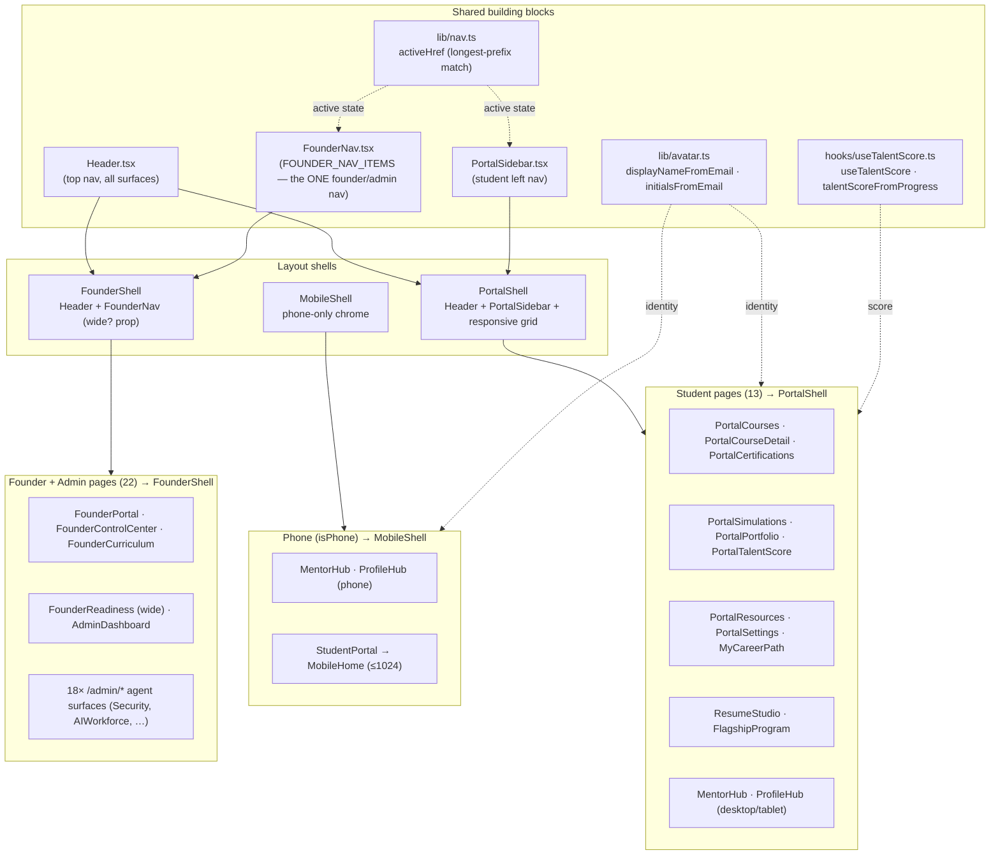

# Shell Architecture — Frontend Layout Consolidation

_Last updated: 2026-06-16 · Branch: `refactor/architecture-consolidation`_

This document is the map produced at the end of the **Architecture Consolidation
Sprint**. It records the single layout shells, the single navigation renderer, and
the single identity/score sources that every authenticated page now composes —
plus the deliberate exceptions and why they exist.

## The rule

> **One shell per surface. One nav renderer. One identity source. One score source.
> No dead components.**

| Surface | Shell | Nav | Background |
|---|---|---|---|
| Student portal (authenticated) | `PortalShell` | `Header` + `PortalSidebar` | per-page DS bg |
| Founder + Admin | `FounderShell` | `Header` + `FounderNav` | `bg-background` |
| Mobile (phone) student | `MobileShell` | mobile chrome | dark |
| Public / marketing | `Header` only (no shell) | `Header` | per-page |

## Composition

## What consolidated

- **PortalShell** — single student shell. `.portal-shell` CSS (in `src/index.css`)
  collapses the fixed-sidebar grid to one column and hides `<aside>`/sidebar at
  ≤1024px, where `Header` carries navigation. Optional `rightRail` for the
  dashboard widgets column.
- **FounderShell** — single founder/admin shell. `wide` prop swaps `max-w-7xl`
  for `max-w-[88rem]` on dense dashboards (FounderReadiness).
- **FounderNav** — the one founder/admin nav renderer (`FOUNDER_NAV_ITEMS`, 23
  items). `WorkforceNav` (the old admin-only nav) was reduced to a re-export
  alias and then **deleted** once it had zero importers.
- **lib/avatar.ts** — one rule for display name + initials, replacing five
  divergent inline `email.split('@')` / ad-hoc initials computations that could
  show the same user different initials on different screens.
- **useTalentScore** — one Talent Score source. `talentScoreFromProgress` (used
  by StudentPortal) and `useTalentScore` (used by PortalTalentScore) derive from
  the same real `useProgress` data — fixing the 612-vs-0 divergence.

## Deliberate exceptions

- **StudentPortal** composes `PortalSidebar` directly (not `PortalShell`) because
  it is the bespoke command-center home: a 3-column top `<nav>` + sidebar + right
  rail with its own grid, and `MobileHome` at ≤1024px. It uses the shared
  `PortalSidebar`, `talentScoreFromProgress`, `displayNameFromEmail`, and
  `activeHref` — so it shares every renderer, just not the generic shell.
  **Open item:** whether to replace its bespoke top `<nav>` with the shared
  `Header` (removes the last duplicate top-nav) — pending founder UX decision.
- **Public / marketing pages** (Index, Pricing, Schools, Employers, Store, Auth,
  ResetPassword, Referral, TalentNetwork, …) use `Header` standalone with no
  shell. They are unauthenticated and intentionally outside the portal chrome.

## Dead components removed during the sprint

- `TalentScorePanel` (superseded by `useTalentScore` + PortalTalentScore)
- `StudentProfileWidget` (superseded by `lib/avatar` identity rendering)
- `WorkforceNav` (re-export alias of FounderNav; zero importers)
- `StudentPortal.tsx.bak3/5/6/7/8/_redesign` (≈570 KB of committed snapshots,
  untracked and removed)

## Verification

`vite build` is the only CI gate (esbuild, no `tsc`, `strict: false`, no test
suite). Every step in the sprint was committed only after a green build.
